# Multi-Tenant eCommerce Platform Documentation

## Table of Contents
1. [Introduction](#introduction)
2. [Architecture Overview](#architecture-overview)
3. [Multi-Tenancy Implementation](#multi-tenancy-implementation)
4. [Database Structure](#database-structure)
5. [Authentication & Authorization](#authentication--authorization)
6. [Key Components](#key-components)
7. [Tenant Lifecycle](#tenant-lifecycle)
8. [Data Isolation](#data-isolation)
9. [Frontend Implementation](#frontend-implementation)
10. [Performance Considerations](#performance-considerations)
11. [Security Measures](#security-measures)
12. [Best Practices](#best-practices)

## Introduction

A robust multi-tenant eCommerce platform built with Laravel and Vue.js using a multi-database tenancy architecture. This application provides strict data isolation between tenants (stores) by using separate databases for each tenant.

### Features

- **Multi-Database Tenancy**: Each store operates with its own dedicated database for maximum data isolation
- **User Authentication**: Tenant-specific user authentication and role-based authorization
- **Product Management**: Complete CRUD operations for products within each tenant store
- **Shopping Cart**: Fully-featured shopping cart system with session management
- **Order Processing**: End-to-end order management from checkout to fulfillment
- **Responsive UI**: Modern interface built with Vue.js and Inertia

### Technologies Used

- **Backend**: Laravel, PHP 8.x
- **Frontend**: Vue.js, Inertia.js
- **Multi-Tenancy**: stancl/tenancy package
- **Styling**: Tailwind CSS
- **Database**: MySQL (configurable)

### Prerequisites

- PHP 8.1+
- Composer
- Node.js & NPM
- MySQL

### Installation

1. Clone the repository
```bash
git clone https://github.com/iniakunhuda/laravel-multi-tenant.git
cd multi-tenant-ecommerce
```

2. Install PHP dependencies
```bash
composer install
```

3. Install JavaScript dependencies
```bash
npm install
```

4. Copy environment file and configure database settings
```bash
cp .env.example .env
```

5. Generate application key
```bash
php artisan key:generate
```

6. Run migrations for the central database
```bash
php artisan migrate
```

7. Create test tenants
```bash
php artisan tenants:create-test
```

8. Seed tenant databases (optional)
```bash
php artisan tenants:seed
```

8. Compile assets
```bash
npm run dev
```

9.  Start the development server
```bash
php artisan serve
```

10.  Running test (optional)
```bash
php artisan test
```

## Screenshots

<table>
  <tr>
    <th colspan="2">Tenant 1 (Electronics & Fashion) <br> http://tenant1.localhost:8000</th>
  </tr>
  <tr>
    <td width="50%">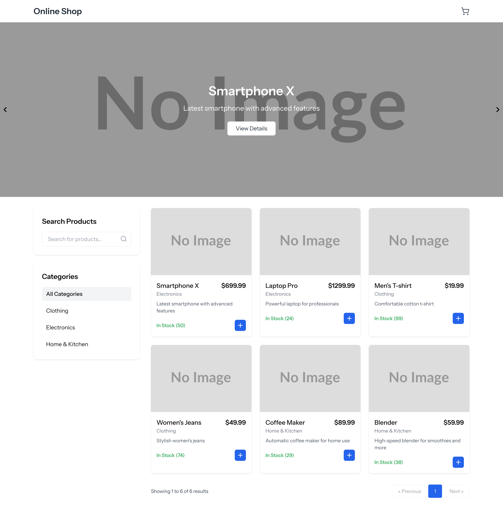<br><strong>Homepage</strong></td>
    <td width="50%">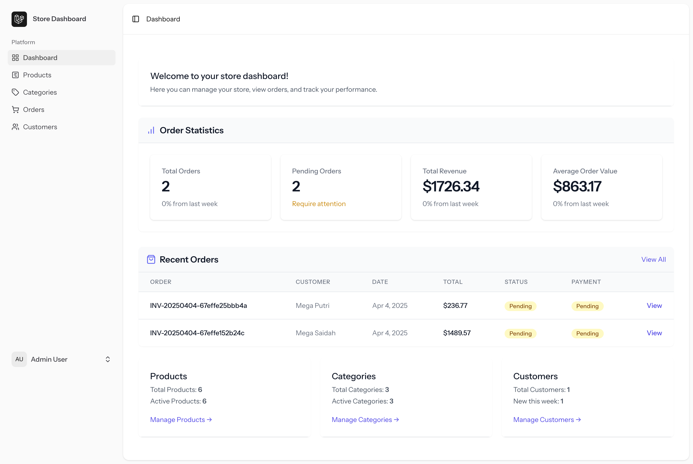<br><strong>Admin Dashboard</strong></td>
  </tr>
  <tr>
    <td width="50%">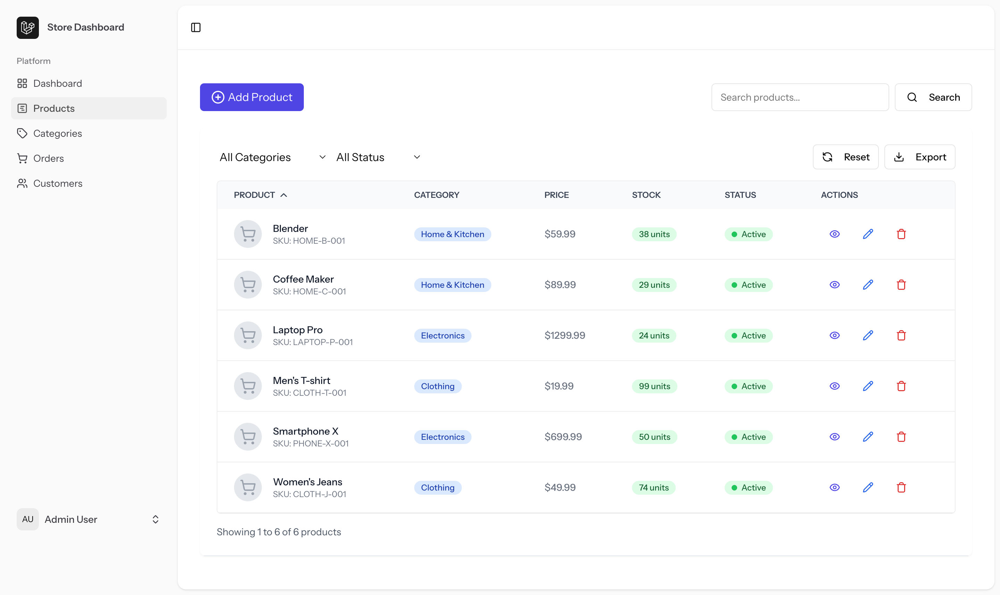<br><strong>Admin Product List</strong></td>
    <td width="50%">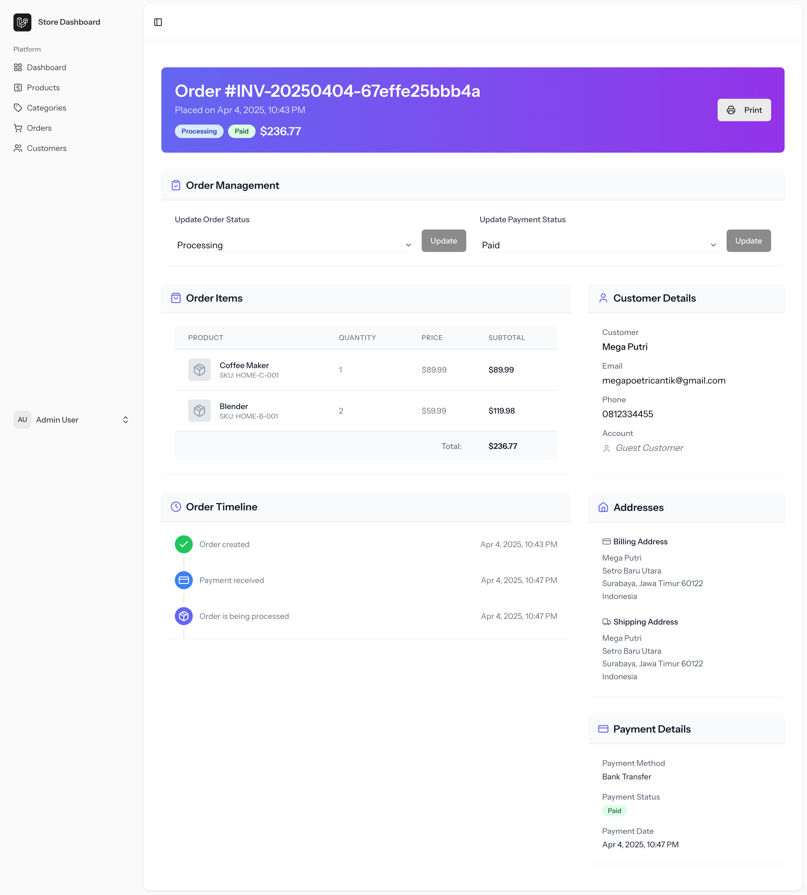<br><strong>Admin Order Detail</strong></td>
  </tr>
  <tr>
    <th colspan="2">Tenant 2 (Food & Grocery) <br> http://tenant2.localhost:8000</th>
  </tr>
  <tr>
    <td colspan="2" align="center">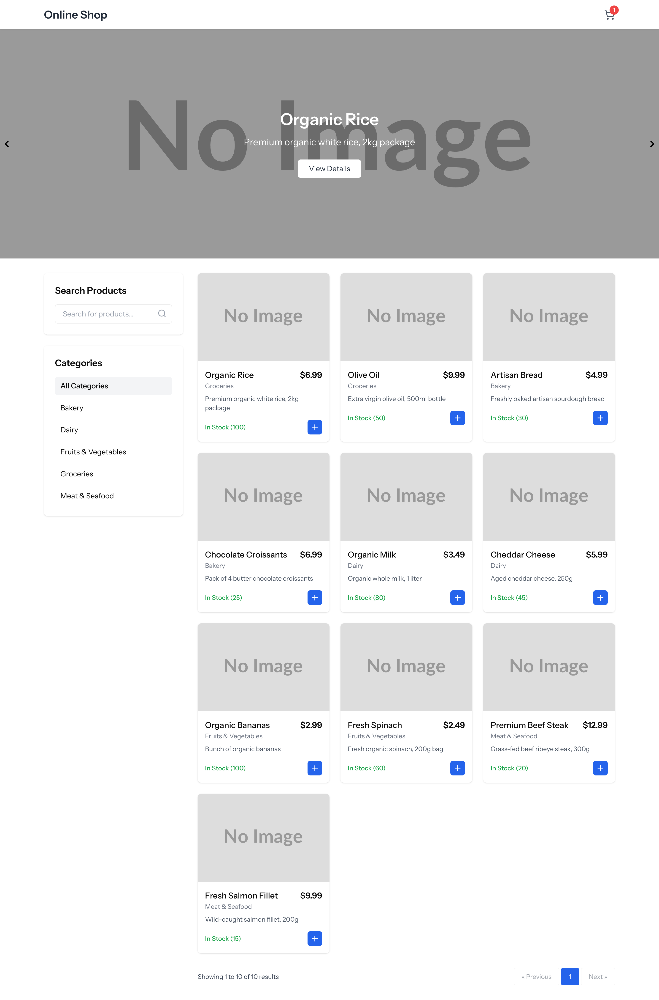<br><strong>Homepage</strong></td>
  </tr>
  <tr>
    <td width="50%">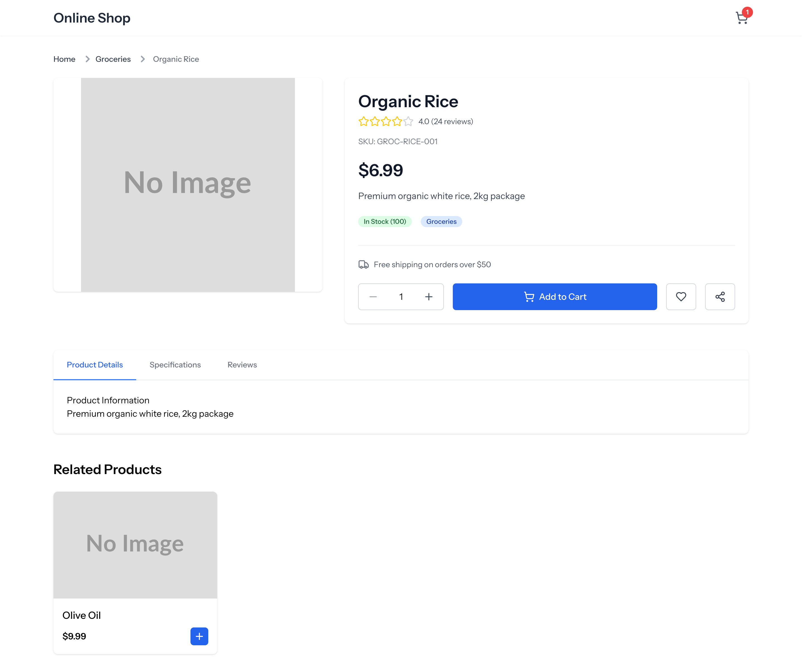<br><strong>Product Detail</strong></td>
    <td width="50%">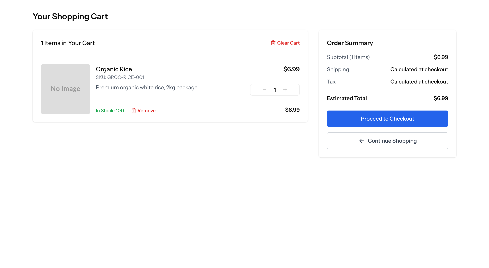<br><strong>Shopping Cart</strong></td>
  </tr>
  <tr>
    <td width="50%">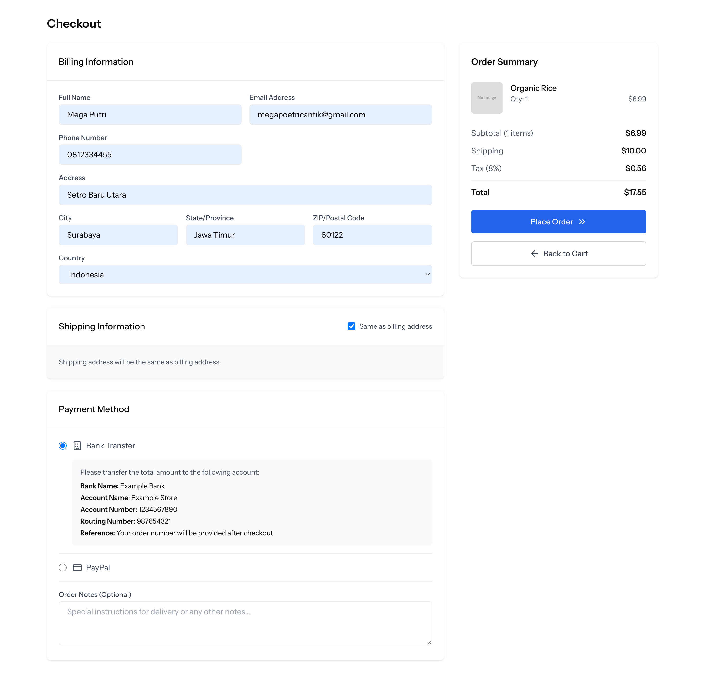<br><strong>Checkout Page</strong></td>
    <td width="50%">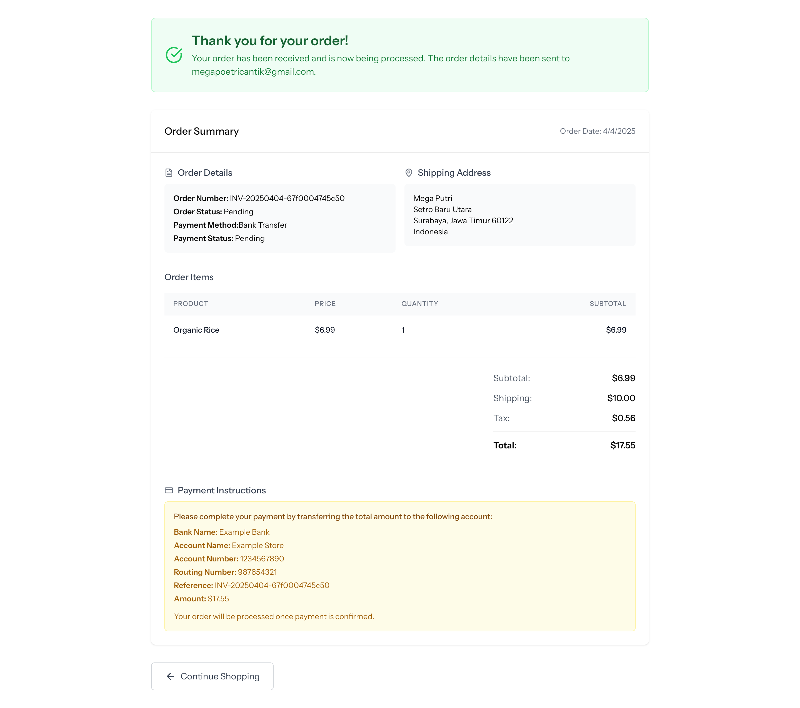<br><strong>Successful Checkout</strong></td>
  </tr>
</table>

## Usage

### Accessing Tenant Stores

Each tenant store is accessible through its own domain:

- Tenant 1: http://tenant1.localhost:8000
- Tenant 2: http://tenant2.localhost:8000

### Administrator Access

Admin users can access the dashboard by logging in at:
http://[tenant-domain]/login

Default admin credentials:
- Email: admin@example.com
- Password: password


## Architecture Overview

### High-Level Architecture

The application follows a multi-database tenancy model where:

1. A central database stores tenant information and domain mappings
2. Each tenant has its own dedicated database containing store-specific data
3. The application dynamically connects to the appropriate tenant database based on the domain request

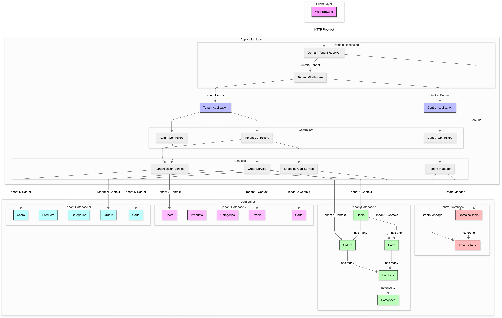

### Database Schema

- The central database with tenants and domains tables
- The tenant database schema showing all tables (users, products, categories, carts, orders, etc.)
- The relationships between entities with proper cardinality

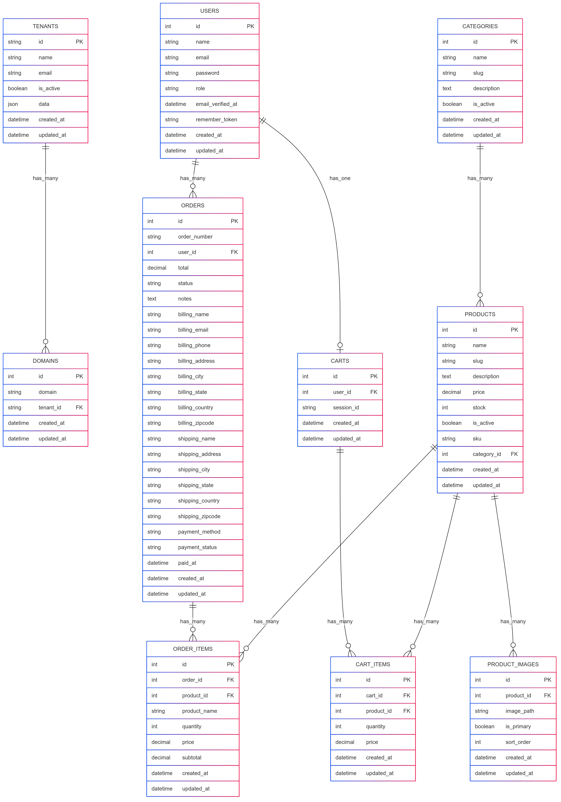

## Tenant Request Flow 

- How the domain is resolved to identify the tenant
- The database connection switching process
- The complete flow from browser request to response
- How data isolation is maintained throughout the request

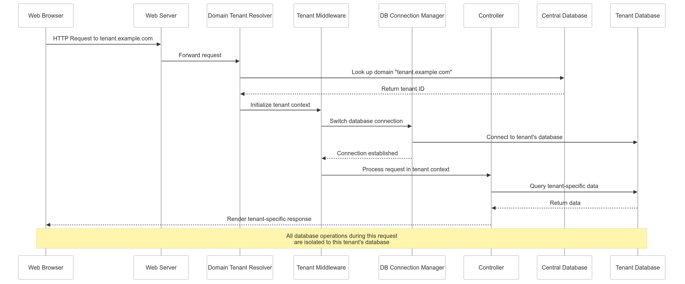


### System Components

- **Central Application**: Manages tenant registration, creation, and administration
- **Tenant Applications**: Individual store instances with isolated data and business logic
- **Tenant Resolver**: Identifies the correct tenant and connects to its database
- **Database Connection Manager**: Handles dynamic database switching

## Multi-Tenancy Implementation

### Technology Stack

The multi-tenancy implementation is based on the `stancl/tenancy` package, which provides:

- Domain-based tenant identification
- Dynamic database connection switching
- Tenant-aware routes and middleware
- Database creation and management tools

### Tenant Model

The `Tenant` model extends `BaseTenant` from the tenancy package and implements `TenantWithDatabase`:

```php
namespace App\Models;

use Illuminate\Database\Eloquent\Factories\HasFactory;
use Illuminate\Database\Eloquent\Model;
use Stancl\Tenancy\Database\Models\Tenant as BaseTenant;
use Stancl\Tenancy\Contracts\TenantWithDatabase;
use Stancl\Tenancy\Database\Concerns\HasDatabase;
use Stancl\Tenancy\Database\Concerns\HasDomains;

class Tenant extends BaseTenant implements TenantWithDatabase
{
    use HasFactory, HasDatabase, HasDomains;

    protected $fillable = [
        'id', 'name', 'email', 'is_active', 'data'
    ];

    public static function getCustomColumns(): array
    {
        return [
            'id',
            'name',
            'email',
            'is_active',
            'data',
        ];
    }
}
```

### Tenant Service Provider

The `TenancyServiceProvider` configures the tenancy system and registers tenant-specific bootstrappers:

```php
namespace App\Providers;

use Illuminate\Support\ServiceProvider;
use Stancl\Tenancy\Middleware\InitializeTenancyByDomain;
use Stancl\Tenancy\Middleware\PreventAccessFromCentralDomains;

class TenancyServiceProvider extends ServiceProvider
{
    public function register()
    {
        // Register tenant bootstrappers and other configurations
    }

    public function boot()
    {
        // Configure tenant routes and middleware
    }
}
```

## Database Structure

### Central Database

The central database contains:

- **tenants**: Stores tenant information (name, email, etc.)
- **domains**: Maps domains to tenants

Migration files:
- `2019_09_15_000010_create_tenants_table.php`
- `2019_09_15_000020_create_domains_table.php`

### Tenant Database

Each tenant has its own isolated database with the following tables:

- **users**: Store administrators and customers
- **categories**: Product categories
- **products**: Store merchandise 
- **product_images**: Images associated with products
- **carts**: Shopping carts for users or sessions
- **cart_items**: Items in shopping carts
- **orders**: Customer orders
- **order_items**: Items in orders
- **sessions**: User sessions

Tenant migrations are stored in the `database/migrations/tenant/` directory.

## Authentication & Authorization

### Multi-Database User Authentication

Authentication is tenant-specific, with each tenant having its own users table. The system:

1. Identifies the tenant based on the domain
2. Connects to the tenant's database
3. Authenticates against the tenant's users table

### User Roles

The User model includes a role field for authorization:

```php
public function isAdmin()
{
    return $this->role === 'admin';
}
```

## Key Components

### Controllers

The application includes various controller types:

1. **Central Controllers**: Manage the central application functionality
   - `HomeController`: Handles central domain routing and tenant listing

2. **Tenant Controllers**: Handle tenant-specific functionality 
   - `Tenant\HomepageController`: Tenant store homepage
   - `Tenant\ProductController`: Customer-facing product display
   - `Tenant\CartController`: Shopping cart functionality
   - `Tenant\OrderController`: Order processing

3. **Admin Controllers**: Manage tenant store administration
   - `Tenant\Manage\ProductController`: Product management
   - `Tenant\Manage\CategoryController`: Category management
   - `Tenant\Manage\OrderController`: Order management
   - `Tenant\Manage\CustomerController`: Customer management
   - `Tenant\Manage\StoreStatsController`: Store statistics

### Models

Key models include:

1. **Central Models**:
   - `Tenant`: Represents a tenant (store)

2. **Tenant Models**:
   - `User`: Store administrators and customers
   - `Category`: Product categories
   - `Product`: Store merchandise
   - `ProductImage`: Product images
   - `Cart`: Shopping carts
   - `CartItem`: Items in carts
   - `Order`: Customer orders
   - `OrderItem`: Items in orders

### Middleware

Custom middleware components:

- `TenantMiddleware`: Ensures proper tenant context
- `HandleAppearance`: Manages tenant-specific appearance settings
- `HandleInertiaRequests`: Configures Inertia.js for the current tenant

## Tenant Lifecycle

### Tenant Creation

Tenants can be created:
1. Manually through the admin interface
2. Programmatically using the `CreateTestTenants` command

The tenant creation process:
1. Creates a tenant record in the central database
2. Creates a domain record associated with the tenant
3. Creates a new database for the tenant
4. Runs migrations on the tenant database
5. Seeds initial data (optional)

### Database Initialization

When a new tenant database is created:
1. All migrations in `database/migrations/tenant/` are executed
2. The `TenantDatabaseSeeder` is run to populate initial data

### Commands

The application includes custom commands:
- `CreateTestTenants`: Creates test tenants for development
- `SeedExistingTenants`: Runs seeders on existing tenant databases

## Data Isolation

### Database-Level Isolation

Each tenant has a completely separate database, providing:
- Strong data isolation
- Independent scaling
- Compliance with data residency requirements
- No risk of data leakage between tenants

### Connection Management

Database connections are managed by:
1. Identifying the tenant through domain resolution
2. Dynamically switching the database connection
3. Maintaining connection separation throughout the request lifecycle

## Frontend Implementation

### Inertia.js Integration

The frontend uses:
- Vue.js components
- Inertia.js for server-client communication
- Tenant-specific page components

### Tenant-Specific UI

Tenant pages are located in `resources/js/pages/tenant/` and include:
- Homepage
- Product detail
- Shopping cart
- Checkout and payment
- Order confirmation

### Admin Interface

The admin interface allows tenant administrators to:
- Manage products and categories
- Process orders
- View customer information
- Access store statistics

## Performance Considerations

### Database Connection Pooling

For production environments, implement connection pooling to:
- Reduce database connection overhead
- Improve request handling capacity
- Optimize resource utilization

### Caching Strategies

Implement tenant-aware caching by:
- Namespacing cache keys with tenant identifiers
- Using database-specific cache stores when necessary
- Implementing cache invalidation strategies

## Security Measures

### Data Isolation Validation

Regularly validate tenant isolation by:
- Testing cross-tenant access attempts
- Verifying middleware is correctly applied
- Auditing database connection switching

### Input Validation

All controllers implement:
- Strict input validation
- SQL injection prevention
- CSRF protection

### User Authentication

Tenant user authentication includes:
- Secure password hashing
- Session management
- Role-based access control

## Best Practices

### Tenant-Aware Development

When developing for this multi-tenant architecture:

1. **Always be tenant-aware**:
   - Check if code will run in tenant context
   - Use tenant-specific paths and URIs

2. **Follow tenancy database conventions**:
   - Place tenant migrations in the tenant directory
   - Use the correct database connection

3. **Test with multiple tenants**:
   - Create test tenants with the provided commands
   - Verify functionality across tenant boundaries

4. **Optimize for scale**:
   - Consider connection limits as tenant count grows
   - Monitor database performance per tenant

### Extending the Platform

When adding new features:

1. Determine if the feature is tenant-specific or central
2. Place migrations in the appropriate directory
3. Update tenant initialization processes if necessary
4. Test with multiple tenants to verify isolation
